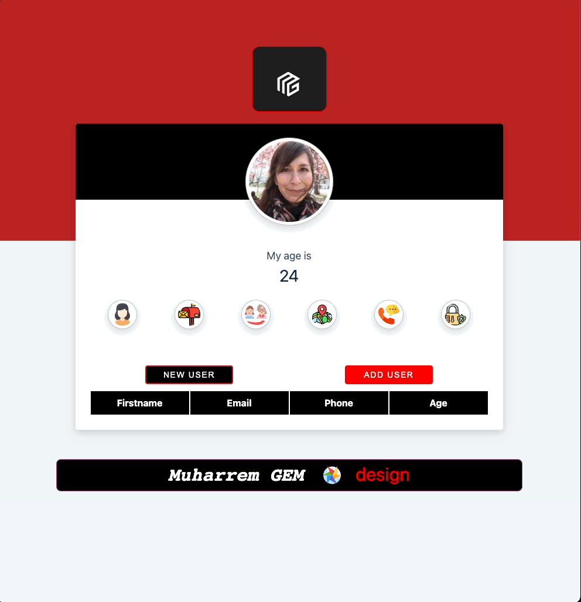

Random User App 2 


  Project Name       |Libraries and Technologies I use     |How does my project look   
:-------------------------|-------------------------|-------------------------
[Random_user_app](https://react-random-user-app.vercel.app/)| Js React | 


I used;

Components

useState

useEffect

axios

import/export

Props

React Developer Tool

Destructuring props

array map method

array some method

## Description


## Problem Statement

- We are adding a new project to our portfolios. So you and your colleagues have started to work on the project.

## Project Skeleton

```
Random User App 2 (folder)
|
|----readme.md         # Given to the students (Definition of the project)
SOLUTION
├── public
│     └── index.html
├── src
│    ├── assets.js
│    │       └── [images]
│    ├── App.js
│    ├── App.css
│    ├── index.js
│    └── index.css
├── package.json
└── yarn.lock
```

## Expected Outcome


## Objective

Build a Random User App using ReactJS.

### At the end of the project, following topics are to be covered;

- HTML

- CSS

- JS

- ReactJS

### At the end of the project, students will be able to;

- Improve coding skills within HTML & CSS & JS & ReactJS.

- Use git commands (push, pull, commit, add etc.) and Github as Version Control System.

## Steps to Solution

- Step 1: Create React App using `npx create-react-app random-user-app-two`.

- Step 2: Build Random User App fetching data from `https://randomuser.me/api/` using `axios`.

- Step 3: Push your application into your own public repo on Github.

- Step 4: Add project gif to your project and README.md file.

- Step 5: You can find project starter folder [here](./starter/)

## Notes

- You can add additional functionalities and design to your app.

**<p align="center">&#9786; Happy Coding &#9997;</p>**
